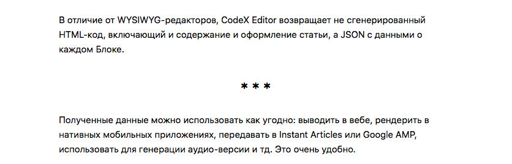

# Delimiter Tool for Editor.js

Delimiter Tool for the [Editor.js](https://editorjs.io).



## Installation

Get the package

```shell
yarn add @editorjs/delimiter
```

Include module at your application

```javascript
import Delimiter from '@editorjs/delimiter';
```

Optionally, you can load this tool from CDN [JsDelivr CDN](https://cdn.jsdelivr.net/npm/@editorjs/delimiter@latest)

## Usage

Add a new Tool to the `tools` property of the Editor.js initial config.

```javascript
var editor = EditorJS({
  ...

  tools: {
    ...
    delimiter: Delimiter,
  }

  ...
});
```

## Config Params

This Tool has no config params

## Output data

This Tool returns empty object.

```json
{
    "type" : "delimiter",
    "data" : {}
}
```

